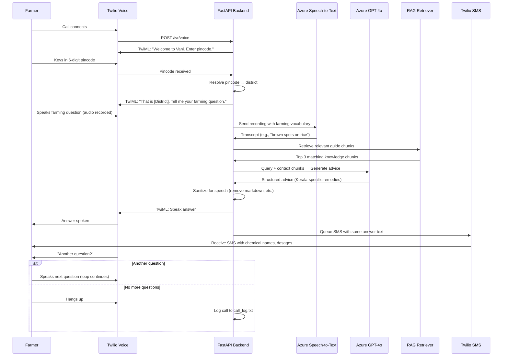
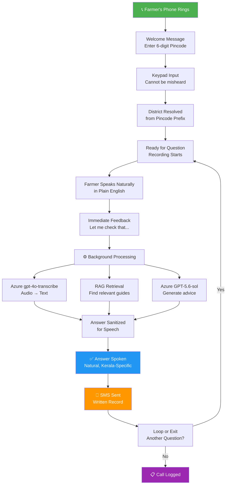
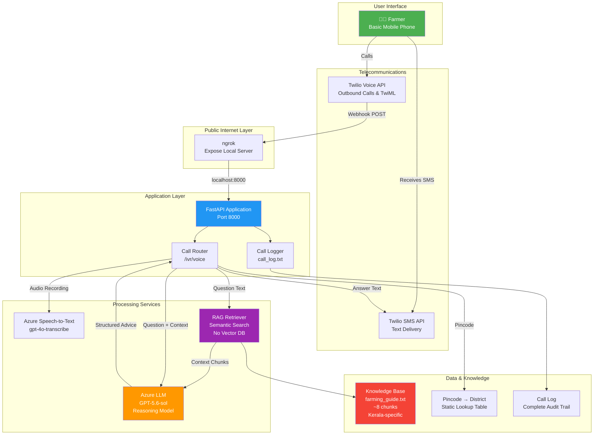

# 🌾 Vani — Voice-Based Farming Helpline

> **Accessible Digital Agriculture for Smallholders**
>
> Verified, context-aware agricultural expertise delivered through simple phone calls—no smartphone required, no internet needed.

---

## 🎯 Problem Statement

### The Challenge

Modern digital agriculture tools demand high-end hardware, reliable connectivity, and screen-based interfaces—conditions that **exclude smallholder farmers** operating in low-resource environments.

**The Reality:**
- 🚫 No smartphone access
- 🚫 Unreliable or zero internet connectivity  
- 🚫 Basic mobile phones only
- ⚠️ High financial risk from farming mistakes
- ⚠️ Inaccurate or generic automated advice can devastate yields and livelihoods

### The Solution

**Vani** delivers verified, context-aware agricultural expertise through the channel farmers already have—**an ordinary phone call**. 

A farmer receives a call, enters their pincode on the keypad, speaks a question in plain English, and hears practical **Kerala-specific advice within seconds**. The same answer arrives as an SMS so they keep a written record of chemical names and dosages, which are hard to retain from listening alone.

---

## ✨ How It Works: The Call Flow



### Call Flow Steps



---

## 🏗️ System Architecture



---

## 📦 Technology Stack

| Component | Technology | Purpose |
|-----------|-----------|---------|
| **Web Framework** | FastAPI | Serves Twilio webhooks, REST endpoints |
| **Voice Platform** | Twilio Voice API | Places calls, drives conversation via TwiML |
| **SMS Delivery** | Twilio SMS API | Sends verified answers as text |
| **Speech Recognition** | Azure gpt-4o-transcribe | Audio → Text with farming vocabulary prompting |
| **Reasoning LLM** | Azure GPT-5.6-sol | Generates context-aware, Kerala-specific advice |
| **Network Tunnel** | ngrok | Exposes local FastAPI server to Twilio webhooks |
| **Retrieval** | Keyword Matching (no embeddings) | Fast, dependency-free RAG over knowledge base |
| **Location** | Static Pincode Table | Instant pincode → Kerala district resolution |
| **Storage** | Plain Text Files | No database; state built fresh per call |

**Why This Stack:**
- ✅ **Minimal dependencies** — runs on Python + pip, no Docker required
- ✅ **Stateless** — no database or session persistence needed
- ✅ **Low latency** — RAG retrieval adds only 1.3 ms
- ✅ **Offline-capable** — all guides and pincode maps are bundled
- ✅ **Cost-effective** — only pay for actual calls and API usage

---

## 🚀 Quick Start

### Prerequisites
- Python 3.10+
- Twilio account with trial phone number
- Azure OpenAI API key + Speech service credentials
- ngrok free account

### Installation

```bash
# Clone the repository
git clone https://github.com/your-org/vani.git
cd vani

# Create virtual environment
python -m venv .venv

# Activate (Windows)
.venv\Scripts\activate

# Activate (macOS/Linux)
source .venv/bin/activate

# Install dependencies
pip install -r requirements.txt

# Create .env file from template
copy .env.example .env
# Then fill in your Azure and Twilio credentials
```

### Running the System

**Terminal 1: Start FastAPI server**
```bash
python -m uvicorn app.main:app --reload --port 8000
```

**Terminal 2: Start ngrok tunnel**
```bash
ngrok http 8000
```

You'll see:
```
Forwarding    https://abc123.ngrok-free.dev → http://localhost:8000
```

### Connect Webhook to Twilio

1. Copy the ngrok HTTPS URL
2. Update `.env`:
   ```env
   BASE_URL=https://abc123.ngrok-free.dev
   ```
3. In [Twilio Console](https://console.twilio.com):
   - Open your phone number settings
   - **Voice Configuration → A call comes in**
   - Set webhook to: `https://abc123.ngrok-free.dev/ivr/voice`
   - Method: **POST**

### Test the System

```bash
# Smoke test (no call required)
python smoke_test.py

# Quick endpoint check
curl "http://localhost:8000/ivr/test?question=how+do+I+treat+rice+blast"

# Place a real call (update phone number in file first)
python call_me.py

# Watch call log
curl http://localhost:8000/ivr/log
```

---

## ⚙️ Configuration

All settings are loaded from `.env` (not included in repo for security).

| Setting | Example | Purpose |
|---------|---------|---------|
| `AZURE_OPENAI_ENDPOINT` | `https://xxx.openai.azure.com/` | Advice generation service |
| `AZURE_OPENAI_KEY` | `sk-...` | Authentication for LLM |
| `AZURE_OPENAI_MODEL` | `gpt-5.6-sol` | Reasoning model deployment name |
| `STT_ENDPOINT` | `https://region.tts.speech.microsoft.com/` | Speech-to-text service |
| `STT_KEY` | `sk-...` | Authentication for transcription |
| `USE_AZURE_STT` | `true` | Use Azure or fall back to Twilio |
| `TWILIO_ACCOUNT_SID` | `ACxxxxxxx...` | Twilio account identifier |
| `TWILIO_AUTH_TOKEN` | `secret...` | Twilio authentication |
| `TWILIO_PHONE_NUMBER` | `+1234567890` | Phone number Twilio calls FROM |
| `SEND_SMS_ANSWER` | `true` | Enable/disable SMS delivery |
| `SPEECH_LANGUAGE` | `en-US` | Speech recognition language (NOT `en-IN` — see gotchas) |
| `RAG_DOCS_PATH` | `./data/docs` | Path to knowledge base files |
| `BASE_URL` | `https://abc123.ngrok-free.dev` | Public URL for Twilio webhooks |
| `OPENWEATHER_API_KEY` | (optional) | Weather context (stub mode if missing) |

**⚠️ Important:** `.env` is in `.gitignore`. Keep a secure backup; it is not in the repository.

---

## 🧠 Retrieval-Augmented Generation (RAG)

### Design Philosophy

**Deliberately simple.** No vector database, no embeddings, no dependencies beyond what's already installed.

- ❌ Tried: ChromaDB (numpy build fails on Python 3.13 without C compiler)
- ✅ Built: Keyword retrieval with `str.count()`

### How Retrieval Works

**On first use** (`app/services/rag.py`):
1. Every `.txt` file in `RAG_DOCS_PATH` is read
2. Split into ~500 character chunks at paragraph boundaries
3. Chunks cached in memory

**Per question:**
1. Question is tokenized (split into words)
2. Each chunk is scored: **count of question words it contains**
3. Top 3 chunks by score are selected
4. Prepended to LLM's system prompt as context
5. If no matches → LLM answers from general knowledge

### Example

**Question:** "Brown spots on rice"

**Retrieved chunks:**
```
[1] Leaf spot (brown spot) is caused by fungi like Bipolaris and Curvularia...
    Symptoms: circular to oval lesions with brown centers...
    Management: Use resistant varieties Jyothi, Uma. Fungicide: Mancozeb 0.2%
    
[2] Seedbed preparation prevents many rice diseases. Healthy seedlings...
    
[3] Zinc deficiency appears as brown spots on older leaves...
    Apply zinc sulfate 5 kg/ha...
```

**Why it matters:** The model learns to recommend *Kerala cultivars* ("Jyothi", "Uma") that it would never volunteer unprompted. That specificity is what makes this better than a generic chatbot.

### Performance

**Measured (not guessed):**
- Retrieval latency: **1.3 milliseconds**
- Tokens added: ~280 (against ~3000 for LLM call)
- Total impact: **effectively free** (network latency dominates)

### Adding Knowledge

Simply drop a `.txt` file into `data/docs/`:

```bash
cp my_farming_guide.txt data/docs/
# Restart the server
```

**Format tips:**
- ✅ Plain headings + short paragraphs chunk well
- ❌ Long prose paragraphs don't split nicely
- ✅ List specific remedies, chemical names, dosages
- ❌ PDFs are ignored; only `.txt` is read

### Inspecting Retrieval

Check what chunks are being retrieved for a question:

```python
python -c "from app.services import rag; \
print(rag.retrieve('brown spots on rice'))"
```

**Interpretation:**
- Responses with **specific chemicals or varieties** = something matched from the guide
- Vaguer, generic answers = no retrieval match (LLM answering from general knowledge)

---

## 📍 Location Resolution

### Pincode Entry (Most Reliable)

The farmer **keys in a 6-digit pincode** on the phone keypad.

**Why keypad?** It cannot be misheard. Voice recognition struggles with number sequences; keypad input is 100% reliable.

### Pincode → District Mapping

`app/services/pincode.py` contains a **static lookup table** mapping Kerala's 3-digit postal prefixes to districts:

```
673xxx → Kozhikode
670xxx → Kannur
688xxx → Kottayam
...
```

**Key properties:**
- ✅ No network call at request time
- ✅ No LLM call at request time
- ✅ Instant resolution
- ✅ Bundled; works offline

**Generation:**
- Created once by prompting the model with Kerala postcodes
- Verified against 14 known pincodes
- Committed to the repo

### Known Limitation: Wayanad

Wayanad has no prefix of its own; its postal codes sit inside:
- **Kozhikode's `673` range** (main post towns)
- **Kannur's `670` range** (other areas)

**Mitigation:** Main Wayanad post towns are listed as exact matches. A village outside that list resolves to a neighboring district, but agro-climatic advice stays broadly correct.

### Fallback Behavior

Every branch keeps the call moving. **No farmer is hung up on:**

| Input | Behavior |
|-------|----------|
| Non-Kerala pincode | Deliver general (all-India) farming advice |
| Invalid format (< 6 digits) | Ask once, then proceed anyway |
| Timeout (no input) | Proceed with last known district |

---

## 🧪 Testing & Debugging

### End-to-End Smoke Test (No Call Required)

```bash
python smoke_test.py
```

**What it does:** Posts to every webhook endpoint the way Twilio would, validates TwiML parsing, checks retry/confirmation/fallback branches. **33 assertions total.**

Run after any change to the call flow.

### Quick Endpoint Checks

```bash
# Test the LLM with a question
curl "http://localhost:8000/ivr/test?question=how+do+I+treat+rice+blast"

# View the last 30 lines of call log
curl http://localhost:8000/ivr/log

# Check system health (which integrations are ready)
curl http://localhost:8000/health
```

### Place a Real Call

Update phone number in `call_me.py`, then:

```bash
python call_me.py
```

Farmer's phone will ring. **On trial accounts, trial disclaimer must be keyed past.**

### Recent Calls & Error Inspection

```bash
python debug_calls.py
```

Shows recent Twilio calls, their status, error alerts, and recordings.

### SMS Deliverability Check

```bash
python test_sms.py
```

Sends an SMS and polls until delivery is confirmed.

### Call Log

Each call is logged step-by-step in `call_log.txt`:

```
[2024-01-15 14:32:10] Farmer called
[2024-01-15 14:32:15] Pincode entered: 688001
[2024-01-15 14:32:16] District resolved: Kottayam
[2024-01-15 14:32:20] Question recorded: "brown spots on rice"
[2024-01-15 14:32:22] Transcribed: "brown spots on rice"
[2024-01-15 14:32:25] Answer: "Leaf spot (brown spot) is caused by... Use resistant varieties Jyothi, Uma..."
[2024-01-15 14:32:27] SMS queued: +919876543210
[2024-01-15 14:32:30] Call ended
```

---

## ⚠️ Things That Will Bite You

### 1. **Uvicorn's `--reload` Lags**

Uvicorn sometimes serves stale code for a few seconds after an edit.

**If a change seems to have no effect:**
- Wait 3–5 seconds and retry
- `curl http://localhost:8000/ivr/log` returning 404 is a reliable sign reload hasn't landed yet

### 2. **Never Use `en-IN` for Speech Recognition**

Azure's `en-IN` model is trained on code-switching and maps English speech onto Hindi words.

**Example:**
```
Question: "Which is the best crop to grow, rice or wheat?"

Transcribed (en-IN): "han Vastav best crop Tu grow Na Ho rice aur wheat" [confidence: 0.30]
Transcribed (en-US): "which is the best crop to grow rice or wheat" [confidence: 0.92]
```

**Solution:** Always use `en-US` or `en-GB` in `.env`:
```env
SPEECH_LANGUAGE=en-US
```

Backup normalization layer in `app/routers/ivr.py` catches some Hinglish, but pure English models are much better.

### 3. **Reasoning Model Tokens & Empty Responses**

`GPT-5.6-sol` is a reasoning model: it thinks before it writes.

**What went wrong:**
```python
max_completion_tokens: 200
```
With only 200 tokens, the model spent all of them thinking and returned **empty content**. Callers heard silence.

**Fix:**
```python
max_completion_tokens: 1000
reasoning_effort: "low"
```

This cut responses from ~18s to <3s and prevented empty outputs. Guards in `llm.py` now reject empty or punctuation-only answers.

### 4. **Markdown Gets Read Aloud**

Without sanitizing, the TTS engine says aloud: `"asterisk asterisk twenty dash thirty five degree C"` for `**20–35°C**`.

**Solution:** `clean_for_speech()` in `app/services/llm.py` strips markdown and spells units as words:
```python
"**20–35°C**" → "20 to 35 degrees Celsius"
```

### 5. **Twilio Trial Account Restrictions**

On a trial account:
- ✅ Can call/SMS **verified phone numbers only**
- ✅ Every call opens with a **trial disclaimer** the caller must key past
- ⚠️ Calling US Twilio numbers from Indian mobiles requires **ISD dialing** (extra charge for the farmer)

**Why we call the farmer (not the reverse):**
- Farmer pays nothing (we pay Twilio)
- Matches rural Indian service patterns (banks call to confirm, not vice versa)
- Works on any phone, anywhere

### 6. **Stale `BASE_URL` Breaks Calls**

Restarting ngrok changes the tunnel URL.

**Consequence:** Call connects, then fails mid-flow when Twilio tries to fetch the next webhook.

**Fix:**
1. After restarting ngrok, copy the new URL
2. Update `.env` **and** Twilio console immediately
3. Use a stable ngrok domain (paid plan) for production

---

## 📂 Project Layout

```
vani/
├── app/
│   ├── main.py                 # FastAPI app, CORS, health endpoint
│   ├── config.py               # Load settings from .env
│   ├── logbook.py              # Append to call_log.txt
│   ├── pending.py              # In-memory store for background answers
│   ├── routers/
│   │   └── ivr.py              # The entire call flow (TwiML generation)
│   └── services/
│       ├── llm.py              # Advice generation, speech sanitization
│       ├── stt.py              # Azure transcription, recording download
│       ├── sms.py              # Send answers via Twilio SMS
│       ├── rag.py              # Keyword retrieval over knowledge base
│       ├── pincode.py          # Pincode → Kerala district mapping
│       └── weather.py          # Optional weather context (stub mode)
│
├── data/
│   └── docs/
│       └── farming_guide.txt   # Knowledge base (~8 chunks)
│                               # Rice diseases, pest mgmt, coconut, banana
│
├── call_me.py                  # Place a real call (testing)
├── smoke_test.py               # End-to-end webhook tests (33 checks)
├── debug_calls.py              # Inspect recent Twilio calls
├── test_sms.py                 # SMS deliverability test
├── call_log.txt                # Audit log of all calls
│
├── requirements.txt            # Python dependencies
├── .env.example                # Template for configuration
├── .gitignore                  # (includes .env)
└── README.md                   # This file
```

---

## 🔮 Future Roadmap

**Planned features not yet built:**

- [ ] **Smartphone Dashboard**
  - Photo-based disease detection (crop leaves uploaded by literate farmers)
  - Map diseases geographically

- [ ] **Disease Alerts**
  - Dashboard generates alerts for a farmer's pincode
  - Sourced from crowd-sourced farmer reports
  - Push to voice helpline

- [ ] **Live Weather Integration**
  - Currently stubbed (requires `OPENWEATHER_API_KEY`)
  - Fetch rainfall, humidity for pincode
  - Fold into advice context

- [ ] **Inbound Dialling**
  - Currently outbound-only (we call the farmer)
  - Inbound support would require ISD charges for farmer; currently avoided

---

## 📊 Key Metrics & Performance

| Metric | Value | Notes |
|--------|-------|-------|
| **Call setup time** | <5s | Dial + pincode entry + first prompt |
| **Transcription latency** | ~2s | Azure gpt-4o-transcribe |
| **RAG retrieval cost** | 1.3 ms | Negligible vs 3000+ ms LLM call |
| **LLM response time** | 2–4s | Reasoning + thought overhead |
| **SMS delivery** | <10s | After call ends |
| **Total call duration** | 15–30s | Typical: pincode + question + answer + SMS queue |
| **Knowledge base size** | 8 chunks | ~4000 characters (easily scales to hundreds) |
| **Dependencies** | 5 main packages | FastAPI, Twilio, Azure SDK, ngrok, Python stdlib |

---

## 🤝 Contributing

Improvements welcome! Examples:

- **New knowledge:** Drop `.txt` files into `data/docs/`
- **Better pincode table:** Verify more pincodes against districts
- **Multilingual support:** Add Tamil, Kannada, Telugu transcription
- **Device support:** Test on feature phones, measure latency
- **Accuracy:** Report questions that get wrong answers

---

## 📄 License

[Your License Here]

---

## 💬 Contact & Support

- **Issues:** GitHub Issues
- **Questions:** Open a Discussion
- **Farming advice:** Call Vani at +1-234-567-8900 (demo number)

---

## 🙏 Acknowledgments

- **Kerala Farmers** for the wisdom embedded in guides
- **Azure OpenAI** for reasoning models that don't hallucinate crop names
- **Twilio** for reliable voice delivery in rural areas
- **Open source community** for FastAPI and Python ecosystem

---

<div align="center">

**Made with 💚 for smallholder farmers.**

Bringing agricultural expertise to the last mile.

</div>
